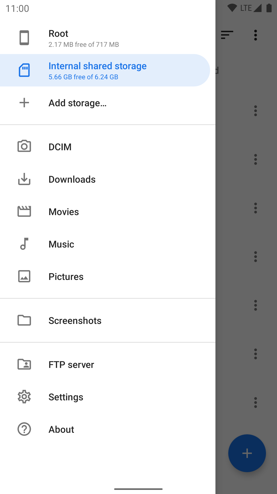
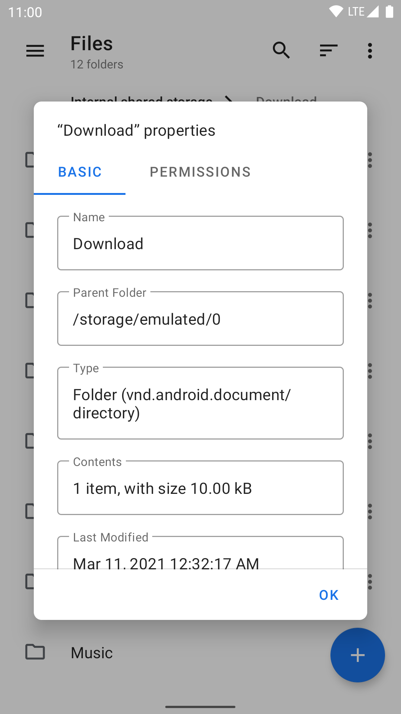
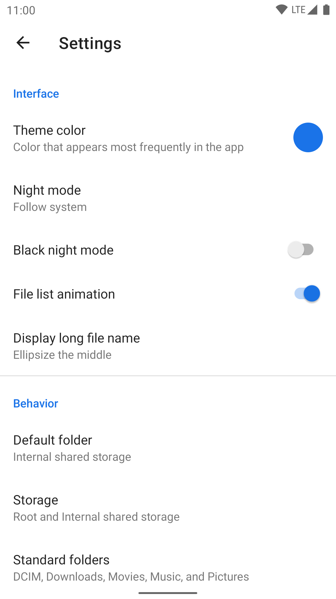
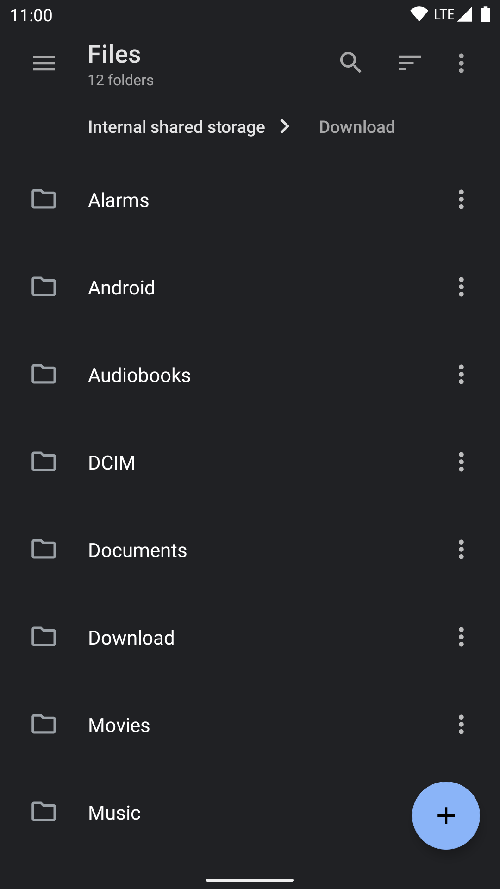
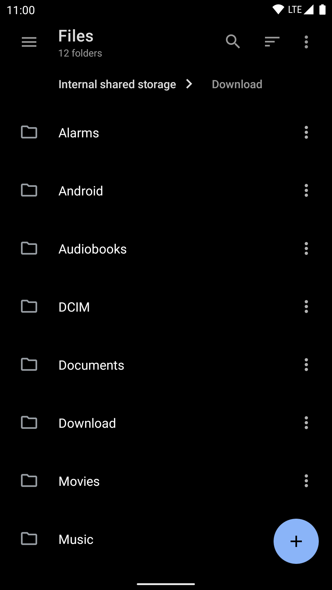

# Nature Files

## Preview

  
  

## Features

- Open source: Lightweight, clean and secure.
- Material Design: Follows Material Design guidelines, with attention into details.
- Breadcrumbs: Navigate in the filesystem with ease.
- Root support: View and manage files with root access.
- Archive support: View, extract and create common compressed files.
- NAS support: View and manage files on FTP, SFTP, SMB and WebDAV servers.
- Themes: Customizable UI colors, plus night mode with optional true black.
- Linux-aware: Like [Nautilus](https://apps.gnome.org/Nautilus/), knows symbolic links, file permissions and SELinux context.
- Robust: Uses Linux system calls under the hood, not yet another [`ls` parser](https://news.ycombinator.com/item?id=7994720).
- Well-implemented: Built upon the right things, including [Java NIO2 File API](https://docs.oracle.com/javase/8/docs/api/java/nio/file/package-summary.html) and [LiveData](https://developer.android.com/topic/libraries/architecture/livedata).

## Why Nature Files?

Because I like Material Design, and clean Material Design.

There are already a handful of powerful file managers, but most of them just aren't Material Design. And even among the ones with Material Design, they usually have various minor design flaws (layout, alignment, padding, icon, font, etc) across the app which makes me uncomfortable, while still being minor enough so that not everybody would care to fix it. So I had to create my own.

Because I want an open source file manager.

Most of the popular and reliable file managers are just closed source, and I sometimes use them to view and modify files that require root access. But deep down inside, I just feel uneasy with giving any closed source app the root access to my device. After all, that means giving literally full access to my device, which stays with me every day and stores my own information, and what apps do with such access merely depends on their good intent.

Because I want a file manager that is implemented the right way.

- This app implemented [Java NIO2 File API](https://docs.oracle.com/javase/8/docs/api/java/nio/file/package-summary.html) as its backend, instead of inventing a custom model for file information/operations, which often gets coupled with UI logic and grows into a mixture of everything ([example](https://github.com/TeamAmaze/AmazeFileManager/blob/master/app/src/main/java/com/amaze/filemanager/filesystem/HybridFile.java)). On the contrary, a decoupled backend allows cleaner code (which means less bugs), and easier addition of support for other file systems.

- This app doesn't use `java.io.File` or parse the output of `ls`, but built bindings to Linux syscalls to properly access the file system. `java.io.File` is an old API missing many features, and just can't handle things like symbolic links correctly, which is the reason why many people rather parse `ls` instead. However parsing the output `ls` is not only slow, but also [unreliable](https://news.ycombinator.com/item?id=7994720), which made [Cabinet](https://github.com/aminb/cabinet/blob/master/app/src/main/java/com/afollestad/cabinet/file/root/LsParser.java) broken on newer Android versions. By virtue of using Linux syscalls, this app is able to be fast and smooth, and handle advanced things like Linux permissions, symbolic links and even SELinux context. It can also handle file names with invalid UTF-8 encoding because paths are not naively stored as Java `String`s, which most file managers does and fails during file operation.

- This app built its frontend upon modern `ViewModel` and `LiveData` which enables a clear code structure and support for rotation. It also properly handles things like errors during file operation, file conflicts and foreground/background state.

In a word, this app tries to follow the best practices on Android and do the right thing, while keeping its source code clean and maintainable.
